<p align="center">
  
</p>

# mercurioplatform/tables

[](https://github.com/mercurioplatform/tables/actions/workflows/ci.yml)
[](https://packagist.org/packages/mercurioplatform/tables)

Reusable list/table engine для админок на Laravel 13 + Bootstrap 5 + jQuery + Blade. Декларативные `Resource`-классы превращаются в полноценные admin-страницы (поиск, сортировка, фильтры, saved views, bulk/row actions, экспорт, prefs, history+undo) одной строкой роута.

## Why

- **1 Resource-класс = 1 admin-страница.** `Route::tablesPage('admin/products', ProductResource::class)` — контроллер не нужен, страница, JSON-эндпоинты для bulk/row/export/prefs/log регистрируются автоматически.
- **5 путей расширения**, не больше: подкласс `Field` → `cellView()` на ячейке → слоты `<x-tables.page>` → SCSS theme tokens → ключи `config/tables.php`. `vendor:publish --tag=tables-views` — эскейп-хатч, когда ничего из перечисленного не подошло.
- **Без vendor lock-in.** Bootstrap 5 + jQuery + Blade-компоненты, без виртуального DOM и SPA-оверхеда. Страница рендерится сервером, AJAX подгружает только `<x-tables.table-root>`.

## Install

```bash
composer require mercurioplatform/tables
```

Опубликовать ресурсы:

```bash
php artisan vendor:publish --tag=tables-config       # config/tables.php
php artisan vendor:publish --tag=tables-migrations   # saved_views / user_table_prefs / action_log / action_progress
php artisan vendor:publish --tag=tables-assets       # resources/{js,scss}/vendor/tables/
php artisan vendor:publish --tag=tables-views        # resources/views/vendor/tables/ — только при необходимости
```

```bash
php artisan migrate
```

JS- и SCSS-бандлы ассетов подключаются в Vite-конфиге хост-приложения (импорт из `resources/{js,scss}/vendor/tables/`).

## Quickstart (30 секунд)

```php
// app/Tables/Catalog/ProductResource.php
namespace App\Tables\Catalog;

use App\Models\Product;
use Illuminate\Database\Eloquent\Builder;
use Mercurio\Tables\Field\StatusField;
use Mercurio\Tables\Field\TextField;
use Mercurio\Tables\ListResource;

class ProductResource extends ListResource
{
    public function key(): string
    {
        return 'catalog.products';
    }

    public function query(): Builder
    {
        return Product::query();
    }

    public function fields(): array
    {
        return [
            TextField::make('id', '#')->sortable()->mono()->align('left'),
            TextField::make('title', 'Название')->sortable(),
            StatusField::make('status', 'Статус')
                ->kinds(['published' => 'success', 'draft' => 'secondary'])
                ->labels(['published' => 'Опубликован', 'draft' => 'Черновик']),
        ];
    }

    public function searchable(): array
    {
        return ['id', 'title'];
    }
}
```

```php
// routes/web.php
use App\Tables\Catalog\ProductResource;
use Illuminate\Support\Facades\Route;

Route::middleware(['auth'])->group(function () {
    Route::tablesPage('admin/products', ProductResource::class);
});
```

> **Namespace hint.** Cell-fields (`Mercurio\Tables\Field\*`) и form-fields для bulk/row schemas (`Mercurio\Tables\Form\Field\*`) делят имена `TextField` и `NumberField`. В Resource'е, использующем оба слоя, удобнее импортировать form-fields под алиасом:
>
> ```php
> use Mercurio\Tables\Field\TextField;
> use Mercurio\Tables\Field\NumberField;
> use Mercurio\Tables\Form\Field\TextField as TextInput;
> use Mercurio\Tables\Form\Field\NumberField as NumberInput;
> ```

Откройте `/admin/products` — рабочая страница со списком, поиском, сортировкой и пагинацией. Bulk/row actions, saved views, фильтры, экспорт включаются добавлением соответствующих методов в `ProductResource` (см. [Features](#features)).

## Features

- [Saved views](#saved-views) — system + user, синхронизируются из Resource-объявления через `php artisan tables:sync-saved-views`.
- [Filter chips + Query Builder](#filters) — chip / select / range / date / boolean + AST-фильтр через `?qb=base64(json)`.
- [Bulk actions](#bulk-actions) — instant / confirm / form / queue (background).
- [Row actions](#row-actions) — link / inline / quick-edit form / popover-confirm.
- [Action log + undo](#action-log) — окно отката для идемпотентных bulk.
- [Prefs popover](#prefs) — видимые столбцы / density / page size, persisted на пользователя.
- [Summary slot](#summary) — KPI и funnel-cards над таблицей.
- [Streaming export](#export) — CSV (default) + JSON + XLSX (opt-in), single endpoint, async fallback через `ExportJobDispatcher`.
- [Localization](#localization) — ru/en из коробки, namespace `tables::*`, расширяется через `vendor:publish --tag=tables-lang`.
- [Inline cell edit](#inline-cell-edit) — декларативный `editableUsing(...)` с policy / rules / transform / options и опциональной регистрацией route'а.

### Saved views

`SavedView::all()` (вся выборка), `SavedView::scope('name', label, scopeOrFilter)`. После изменения объявления — `php artisan tables:sync-saved-views` синхронизирует system-views в БД (для каждого `key()`).

```php
public function savedViews(): array
{
    return [
        SavedView::all('Все')->default()->position(0),
        SavedView::scope('published', 'Опубликованные', 'published')->color('green')->position(1),
        SavedView::scope('draft', 'Черновики', 'draft')->color('amber')->position(2),
    ];
}
```

### Filters

Любой `Field` объявляется фильтруемым через `->filterable([Operator::In, Operator::Between, ...])`. Для relation-полей (`BelongsToField`, `BelongsToManyField`) автокомплит подгружает опции через `/<base>/options`. Расширенный фильтр (Query Builder) включается автоматически — кнопка в `filter-bar:right`.

```php
TextField::make('id', '#')->filterable([Operator::In]),
MoneyField::make('cached_price_cents', 'Цена')
    ->filterable([Operator::Between, Operator::Gt, Operator::Lt]),
```

### Bulk actions

Четыре kind: `instant()` (одним POST), `confirm()` (с превью), `schema(...)` (form в offcanvas), `->queue()` (фоном через очередь Laravel).

```php
public function bulkActions(): array
{
    return [
        BulkAction::make('publish', 'Опубликовать')
            ->instant()
            ->handler(BulkUpdateStatusProductsAction::class)
            ->payload(['status' => 'published'])
            ->policy(ProductPolicy::class, 'update')
            ->undoable(
                capture: fn (array $ids) => Product::whereIn('id', $ids)->pluck('status', 'id')->all(),
                reverse: fn (array $ids, array $snapshot) => $this->reverseStatus($snapshot),
            ),
    ];
}
```

### Row actions

`RowAction::link()` — ссылка с иконкой; `RowAction::make()->using(fn)` — inline-handler; `->schema([...])` — quick-edit form в offcanvas; `->confirm()->preview(fn)` — popover-подтверждение.

```php
RowAction::make('quick-edit', 'Быстрое редактирование')
    ->schema([
        SelectField::enum('status', 'Статус', ProductStatus::class)->required(),
    ])
    ->using(fn ($row, $payload, $actor) => /* ... */),
```

### Action log

Append-only лог успешных bulk/row-действий пишется автоматически в `tables_action_log`. Двух-уровневое управление:

- **Глобальный kill-switch** — `config('tables.action_log.enabled', true)`. `false` → writer не пишет ни одной записи; UI на странице тоже ничего не показывает.
- **Per-resource UI toggle** — `actionHistoryEnabled(): true` на конкретном Resource. По умолчанию `false`: записи в БД пишутся (если глобальный flag `true`), но HeaderAction «История» в page-head не появляется и offcanvas с журналом не доступен. `true` → в header добавляется кнопка «История», offcanvas + undo (для `undoable()`-actions в окне `undo_window_minutes`) активны.

Сознательный design: писать заранее, чтобы при включении UI на ресурсе позже история была сохранена с момента deploy'а, а не с момента переключения flag'а.

### Prefs

Per-user настройки видимых столбцов / density / page size — popover «Настроить таблицу» в `filter-bar:right`. Хранятся в `tables_user_table_prefs` (user_id, resource_key). URL > DB > defaults — приоритет разрешения.

### Summary

Слот над таблицей для KPI/funnel-карточек. Объявляется на ресурсе:

```php
public function summary(): ?Summary
{
    return KpiSummary::make([
        KpiCard::make('total', 'Всего товаров', fn () => Product::count()),
        KpiCard::make('published', 'Опубликовано', fn () => Product::where('status', 'published')->count()),
    ]);
}
```

Host может добавить собственные карточки — наследник `SummaryCard` + host-namespaced Blade-template (`Blade::anonymousComponentNamespace(...)` в `AppServiceProvider`). Опционально регистрируется по slug'у в `config('tables.summary_cards')`. Подробности и обработка ошибок рендера — [docs/summary-cards.md](docs/summary-cards.md).

### Export

Стрим в нескольких форматах на текущее состояние списка (search + view + chips + qb + sort + visible columns) через единый endpoint `?format=csv|json|xlsx`. CSV/JSON встроены, XLSX — opt-in (`composer require openspout/openspout`). Лимит — `config('tables.export.sync_limit')`; выше — `ExportJobDispatcher` (опционально) или HTTP 413. UI рендерит dropdown форматов автоматически, если зарегистрировано больше одного writer'а. Подробности и кастомный writer — [docs/export.md](docs/export.md).

### Inline cell edit

Поле объявляется редактируемым через `editableUsing(...)` — один primary-метод, мерджащий policy / validation rules / опциональный `transform` / целевую колонку БД / опции для select-инпута. Старые shortcut-методы (`editable`, `editColumn`, `editPolicy`, `editRules`, `editOptions`) остаются и совместимы.

```php
TextField::make('title')
    ->editableUsing(
        policy: [ProductPolicy::class, 'edit'],
        rules: ['required', 'string', 'max:255'],
        transform: fn (string $value) => trim($value),
    ),

BelongsToField::make('category')
    ->editableUsing(
        policy: [ProductPolicy::class, 'updateCategory'],
        options: fn () => Category::orderBy('title')->pluck('title', 'id')->all(),
    ),
```

Pipeline на `PATCH {base}/cells/{id}/{field}`: `policy` → `rules` → `transform` → `update()` внутри транзакции. Любой Throwable из `transform` логируется как `tables.cell_edit.transform_failed` и возвращает `422` с translation-ключом `tables::cell_edit.transform_failed`.

Если ресурс read-only — переопределите `ListResource::cellEditEnabled(): false`, и route не будет регистрироваться вовсе (404).

### Localization

Пакет поставляется с двумя локалями — **ru** и **en** — namespace `tables::*` (12 групп: `action_log`, `bulk`, `cell`, `confirm`, `export`, `filters`, `prefs`, `qb`, `row_actions`, `saved_views`, `shell`, `summary`). Переключение через `App::setLocale()`. Runtime JS обращается к строкам через `window.TablesI18n` + helper `tablesT(key, params)`.

Дефолты в `config/tables.php` для UI-меток (`qb_button_label`, `export.button_label`, `user_prefs.popover_button_label`, `action_log.header_action_label`) указаны как translation keys пакета — переопределение в хосте может передать как ключ (`'app::custom.label'`), так и готовую строку.

```bash
php artisan vendor:publish --tag=tables-lang
```

Подробности в [docs/i18n.md](docs/i18n.md).

## Configuration

Все ключи — в `config/tables.php` (опубликуйте через `vendor:publish --tag=tables-config`). Ключевые:

- `guard` — guard для policy/Gate-проверок (default `admin`).
- `default_per_page` — fallback для `perPage()` в Resource (default 25).
- `partial_header` — заголовок AJAX-частичного рендера (default `X-Tables-Partial`).
- `js_event_prefix` — префикс DOM-событий (`tables:rendered`, `tables:loading`, `tables:total-changed`).
- `resources` — массив FQN ResourceClass для `ResourceRegistry` (используется sync-savedviews и Query Builder).
- `sync_system_views` — авто-вызов `SystemViewSyncer` в `boot()` (default `true`).
- `action_log.enabled`, `action_log.undo_window_minutes`, `action_log.undo_snapshot_max_bytes` — журнал и окно отката.
- `bulk_progress.*` — настройки фоновых bulk-actions (poll-интервал, job-class, chunk-size).
- `export.sync_limit`, `export.chunk_size`, `export.csv_*`, `export.async_dispatcher` — CSV-экспорт.
- `shell.layout`, `shell.page_head_component`, `shell.flash_keys`, `shell.title_suffix` — обёртка страницы.
- `tables.*` — имена БД-таблиц движка (для overrides на стороне хоста).

## Extending

Пять путей, в порядке возрастания инвазивности:

1. **Подкласс `Field`** — собственный тип ячейки. Достаточно `protected string $cellView = 'admin.tables._cell-foo'` и Blade-шаблон с `$value`/`$row` в скоупе.

   ```php
   class ColorSwatchField extends Field
   {
       protected string $cellView = 'admin.tables._cell-color-swatch';
   }
   ```

2. **`->cellView('partial.name')`** на ячейке существующего поля — без подкласса, переопределить только рендер ячейки.

3. **Слоты `<x-tables.page>`** — `header`, `summary`, `empty-state` принимают произвольный Blade.

4. **SCSS theme tokens** — переопределить переменные пакета в собственном бандле (импорт `resources/scss/vendor/tables/_tokens.scss` после собственных).

5. **Config keys** — поведение, не вёрстку (`tables.bulk_progress.poll_interval_ms`, `tables.export.sync_limit`, …).

Эскейп-хатч: `vendor:publish --tag=tables-views` копирует blade-компоненты в `resources/views/vendor/tables/` — приоритет публикации над пакетом.

## Development

```bash
cd packages/tables
composer install
composer ci          # pint --test + phpstan analyse
composer pint:fix    # автофикс стиля
composer phpstan     # только статика
```

Тесты в пакет не вкладываются; регрессии проверяются на host-приложении.

## License

MIT © Timur Turdyev
